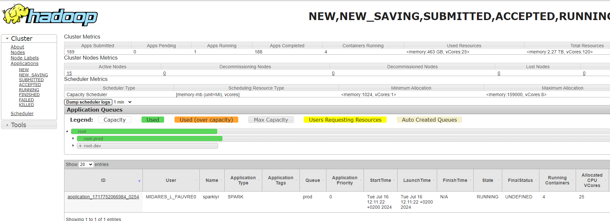

# Les bonnes pratiques 🤝

## Mode local : inadapté et mauvaise pratique {.smaller}

 

Spark et le mode local :

-   un seul ordinateur alors que spark est fait pour **plusieurs ordinateurs** distincts

-   beaucoup **moins de ressources** disponibles sur la bulle que sur le cluster

-   mauvaise gestion de l'allocation des ressources entre utilisateurs : **pas faite pour plusieurs utilisateurs**

-   ralentissements considérables et bugs : **bloque les autres utilisateurs**

    ▶️spark n'est adapté que pour le cluster de calcul, la bulle pour faire du R sans spark sur des données peu volumineuses

## Utiliser les configuratoins recommandées {.smaller}

Les ordinateurs du cluster ont besoin de **s'envoyer des données par le réseau** : c'est la partie la plus lente d'un programme spark !

Si j'augmente les ressources : par exemple, je réserve 3 ordinateurs du cluster plutôt que 2

1.  **Effet puissance de calcul** : plus de ressources pour faire les calculs = réduction du temps de calcul

2.  **Effet augmentation des échanges réseau (shuffles)** : augmentation du temps de calcul

3.  **Gêne des autre utilisateurs**

## Ne pas collecter {.smaller}

::: callout-note
## Collecter, c'est quoi ?

Collecter c'est utiliser l'instruction `collect()`. Elle permet de rapatrier l'ensemble des résultats du cluster vers la bulle et la session R de l'utilisateur en format R, par exemple des `data.frames`.

`Collect()` :

1.  est une **action** : elle déclencher tous les calculs

2.  implique des **échanges réseau** très importants : entre ordinateurs du cluster et du cluster vers la bulle : c'est extrêmement long, moins efficient que l'enregistrement sur disque directement depuis spark

3.  rappatrie les résultats (une table) dans la mémoire vive de R, qui est sur la bulle : si le résultat est volumineux, cela **bloque les autres utilisateurs**
:::

Recommandations :

-   Ne pas collecter des tables de plus de 15 Go

-   Utiliser les autres méthodes proposées pour ne pas bloquer les utilisateurs qui ont besoin de R en mode classique

-   Ne pas changer les configurations

## Fermer sa session {.smaller}

Il faut impérativement fermer sa session spark après une session de travail. Deux moyens pour ça :

-   fermer R Studio

-   si on ne ferme pas RStudio, utiliser la fonction `spark_disconnect_all()` dans son code

Si on souhaite lancer un code le soir en partant, on n'oublie pas le `spark_disconnect_all()` à la fin du code.

::: callout-warning
## Partage des ressources

Les ressources réservés par un utilisateur ne sont libérées pour les autres que lorsqu'il se déconnecte. Ne pas se déconnecter, c'est bloquer les ressources. Si j'ai réservé deux ordinateurs du cluster sur 15, personne d'autres ne peut les réserver tant que je n'ai pas déconnecter ma session spark.

Nous fermerons les sessions ouvertes trop longtemps (départ de congés sans déconnexion) si des utilisateurs présents en ont besoin : risque de perte du travail non enregistré.
:::

Pour ne pas bloquer les collègues 👨‍💻

## Yarn {.smaller}

Yarn permet de consulter la réservation des ressources par les utilisateurs.

On peut y accéder en copiant le lien suivant dans Google chrome sur la bulle (mettre en favori) : midares-deb11-nn-01.midares.local:8088/cluster

Vérifier que notre session est fermée et qu'on ne prend pas trop de ressources : **yarn**

## Mutualiser les expériences {.smaller}

-   Aide au passage d'un code sur le cluster

-   Programmer entre collègues

-   Contributions à la documentation MiDAS : section fiches, à l'aide de pull requests sur github

{fig-align="center"}
