## Au programme

1.  MiDAS : une base de données volumineuse 📚

2.  Utiliser MiDAS avec R : un défi 💭

3.  `sparklyr` dans l'écosystème de R : quiz ❓

4.  La syntaxe `sparklyr` : une syntaxe familière, celle de `dplyr`👨‍💻

5.  Le cluster spark : distribution des données️ 📂

6.  Le cluster spark : distribution des traitements ⏳

7.  Quelques bonnes pratiques  🤝

8.  Pour aller plus loin 💡

# Un rapide tour de table 💬

# MiDAS : une base de données volumineuse 📚

## Qu'est-ce que MiDAS ?

{fig-align="right" width="900"}

{fig-align="right" width="780"}

## Une des bases les plus volumineuses du SSP {.smaller}

{fig-align="center"}

Les administrations dont les données sont comparables à MiDAS utilisent un cluster Spark : Insee, Drees, Acoss, UNEDIC, Cnaf

▶️Le cluster spark est une solution très efficiente pour traiter des données de cette ampleur.

## Concrètement, qu'est-ce que MiDAS ? {.smaller}

{fig-align="center"}

Midas est disponible sous la forme de plusieurs tables au format parquet.

## La documentation en ligne {.smaller}

<br>

::::: columns
::: {.column width="35%"}
[Documentation en ligne](https://documentationmidas.github.io/Documentation_MiDAS/Presentation/pr%C3%A9sentation.html)

-   Dictionnaire des données

-   Fiches présentant les concepts de l'indemnisation, du retour à l'emploi

-   Exemples d'implémentation en spark avec R

-   Conseils qualité des variables
:::

::: {.column width="65%"}
{fig-align="center"}
:::
:::::

# Et vous, quels sont vos usages de MiDAS ? 👁️‍🗨️

# Traiter MiDAS en R : un défi 👨‍💻

## Traiter MiDAS en R classique : les limites {.smaller}

Nous ne pouvons pas manipuler les données Midas exhaustives sur notre ordinateur portable professionnel avec R classique pour deux raisons :

1.  En R classique, les données sont chargées en mémoire RAM : si les données sont plus volumineuses que la mémoire disponible, il n'est pas possible de les traiter.

```{r}
#| eval: false
#| echo: true
  
  path_fna <- "C:/Users/Public/Documents/MiDAS_parquet/Vague 4/FNA/"
  
  PJC <- read_parquet(paste0(path_fna, "pjc.parquet"), memory = TRUE)
  ODD <- read_parquet(paste0(path_fna, "odd.parquet"), memory = TRUE)


```

. . .

2.  La structure de Midas nécessite de réaliser des opérations coûteuses en ressources : appariement de nombreuses tables à apparier entre elles.

```{r}
#| eval: false
#| echo: true
  
jointure <- PJC %>%
  rename(KROD1 = KROD3) %>%
  left_join(ODD, by = c("id_midas", "KROD1"))


```

Et sur un serveur partagé comme la bulle CASD, est-ce possible ?

## Une bulle CASD {.smaller}

::: panel-tabset
### Le disque dur

Le disque dur, aussi appelé **Hard Disk Drive (HDD)**, est une solution de **stockage permanente** :

-   Les données sont conservées même **après l'arrêt de l'appareil**.

-   L'espace de stockage est **volumineux**.

-   Les opérations d'écriture et de lecture ne sont pas du tout instantannées.

### La mémoire vive

La mémoire vive, aussi appelée **RAM**, se distingue de la mémoire de stockage (disque) :

-   par sa **rapidité**, notamment pour fournir des données au processeur pour effectuer des calculs ;

-   par sa **volatilité** (toutes les données sont perdues si l'ordinateur n'est plus alimenté) ;

-   par l'accès direct aux informations qui y sont stockées, **quasi instantanné**.

### Le processeur

Le processeur :

-   permet d'**exécuter des tâches et des programmes** : convertir un fichier, exécuter un logiciel.

-   est composé d'un ou de plusieurs **coeurs** : un coeur ne peut exécuter qu'une seule tâche à la fois. Si le processeur contient plusieurs coeurs, il peut exécuter autant de tâches en parallèle qu'il a de coeurs.

-   se caractérise aussi par sa **fréquence** : elle est globalement proportionnelle au nombre d'opérations qu'il est capable d'effetuer par seconde.
:::

## Une bulle CASD {.smaller}

Pour des raisons de sécurité, les données Midas ne doivent être manipulées que via la bulle CASD sécurisée Midares dotée d'un cluster spark. Les ressources de la bulle sont partagées entre tous les utilsateurs simultanés :

-   256 Go de mémoire vive (ou RAM)
-   Un processeur (ou CPU) composé de 16 coeurs

Même si ces ressources sont plus importantes que celle d'un ordinateur portable classique, elles ne suffisent pas pour traiter Midas. De plus, les utilisateurs sont en concurrence sur les ressources de la bulle.

{fig-align="center"}

## Quizz

Le quizz suivant s'adresse aux personnes familières avec :

-   R classique en syntaxe `tidyverse` ;

-   le format parquet et son traitement en R avec `arrow` ;

-   `duckDB` et `dbplyr` ;

-   éventuellement `data.table` .

# ❓Quizz ❓ `sparklyr` dans l'écosystème de R

## Contexte {.smaller}

Vous travaillez sur votre ordinateur professionnel de la Dares. Vous disposez donc de 16 Go de mémoire RAM, d'un disque dur de plusieurs centaines de Go et de 6 coeurs dans votre processeur. Ce sont vos **ressources informatiques** sur lesquelles les traitements sont exécutés.

Vous travaillez uniquement en R via RStudio. Vous souhaitez effectuer des opérations de **traitement de données** et non de l'économétrie : sélectionner des colonnes, filtrer des lignes, etc.

Vous avez le choix entre différentes **syntaxes** : `dplyr`, `data.table`, `SQL`dans `duckDB`. Nous n'abordons pas R base.

Vous avez aussi le choix entre différents **moteurs de calcul** : R classique avec des `data.frames`, `duckDB`, `arrow`, `data.table`.

L'objectif de ce quizz est de comprendre les similitudes entre ces solutions que certains d'entre vous connaissent déjà, et spark avec `sparklyr`, la solution qui vous est présentée pour traiter les données Midas.

## Question 1 — syntaxe et moteur de calcul {.smaller .scrollable}

**Avec quel moteur de calcul peut-on utiliser directement les fonctions principales de `dplyr` ?**

Les fonctions principales sont `filter()`, `mutate()`, `select()`, `summarise()`.

-   A. `DuckDB`
-   B. `arrow`
-   C. `data.table`
-   D. R classique sur un `data.frame` ou un `tibble`

. . .

::: {.callout-tip title="Réponse"}
Les bonnes réponses sont A, B et D :

-   `DuckDB` est compatible avec la syntaxe `dplyr` grâce au package `dbplyr` ;

-   `arrow` et ses datasets sont compatibles avec cette syntaxe également ;

-   les formats classiques de R (`data.table`, `tibble`) peuvent aussi être manipulés via cette syntaxe.

-   `data.table` peut également recevoir une syntaxe `dplyr` avec `dtplyr`, qui n’est pas abordé ici. `data.table` est un moteur de calcul qui dispose initialement de sa propre syntaxe.
:::

. . .

::: {.callout-note title="Définitions"}
`dplyr` fournit une **syntaxe** de code : une syntaxe permet de décrire ce que l’on veut faire : filtrer, agréger, joindre, etc.

Le **moteur de calcul** est le logiciel qui **exécute** réellement ces opérations, par exemple R, `DuckDB` ou `arrow`.

`data.table` est à la fois un moteur de calcul et une syntaxe particulière.

L’**endroit d’exécution** correspond aux ressources utilisées : ordinateur personnel dans notre cas, mais ce peut être un serveur partagé comme la bulle Midares. Un même moteur peut fonctionner dans plusieurs environnements.
:::

. . .

::: {.callout-important title="À retenir pour Spark"}
Spark est un **moteur de calcul**. La syntaxe `dplyr` est compatible avec ce logiciel grâce aux packages `sparklyr` et `dbplyr`. Spark est exécuté sur un **cluster spark**, un nouvel endroit d'exécution.
:::

## Question 2 — utilisation de `dplyr` avec différents moteurs {.smaller .scrollable}

**Avec `arrow` et `duckDB`, quelles fonctions du `tidyverse` ne peut-on parfois pas utiliser ?**

-   A. Les fonctions de `lubridate`
-   B. `group_by()`
-   C. `rowwise()` pour le traitement ligne par ligne
-   D. `case_when()`

. . .

::: {.callout-tip title="Réponse"}
Les bonnes réponses sont A, et C : en `duckDB` et en `arrow()`, toutes les fonctions du package `lubridate` ne sont pas utilisables. La logique ligne par ligne n'est pas non plus disponible.
:::

. . .

::: {.callout-note title="Définitions"}
Une syntaxe `dplyr` est en fait traduite dans le langage adapté au moteur de calcul :

-   `dbplyr` permet de traduire `dplyr` en requête SQL ;

-   `arrow` permet de traduire `dplyr` en instructions exécutables sur un dataset arrow.

Si une fonction ne dispose pas d'une **traduction** **compatible avec le moteur de calcul**, alors elle n'est pas utilisable.
:::

. . .

::: {.callout-important title="À retenir pour Spark"}
Spark est un moteur de calcul.

Les packages `sparklyr` et `dbplyr` rendent compatibles les instructions `dplyr` avec ce moteur de calcul : `dbplyr` **traduit** les verbes `dplyr` en **Spark SQL**, lui-même traduit en **instructions spark natives** exécutables par le moteur de calcul spark.

Néanmoins, toutes les fonctions du `tidyverse` ne sont pas disponibles avec spark : c'est le cas de nombreuses fonctions de `lubridate` et de `stringr`, ainsi que de certaines fonctions de R base comme `nrow()`.
:::

## Question 3 — lecture paresseuse de données {.smaller .scrollable}

**Que se passe-t-il quand on utilise `arrow::open_dataset()` sur un dossier de fichiers Parquet ?**

-   A. L'ensemble des lignes est immédiatement chargé en session R, c'est-à-dire dans la mémoire RAM.
-   B. On peut ouvrir la table à partir de l'environnement de RStudio en cliquant dessus.
-   C. `arrow` examine les métadonnées de la table : colonnes, type des colonnes = schéma de données (numérique, caractère, date), partitionnement des fichiers (un fichier par mois par exemple) etc.
-   D. Les colonnes et les lignes utiles pourront être lues plus tard lors de l'exécution d'un traitement.

. . .

::: {.callout-tip title="Réponse"}
Les bonnes réponses sont C et D : `arrow::open_dataset()` ouvre une vue logique sur un ensemble de fichiers, **sans charger** immédiatement toutes les données dans R.

Comme les données ne sont pas chargées dans la session R, on ne peut pas ouvrir ces données et les consulter via l'environnement, contrairement à un `data.frame` R classique.

`arrow` peut consulter certaines **métadonnées** afin d’identifier notamment les fichiers du dataset, les colonnes, leurs types et les éventuelles partitions.
:::

. . .

::: {.callout-note title="Définitions"}
On dit qu'avec `arrow::open_dataset()`, la **lecture des données est paresseuse/lazy**.

Avec `read_parquet(ma_table, as_data_frame = TRUE)`, la lecture n'est pas lazy : la table est chargée en session R comme un `data.frame` classique.

`duckdb::tbl_file(con, "data.parquet")` est aussi une lecture paresseuse des données.
:::

. . .

::: {.callout-important title="À retenir pour Spark"}
Spark est **compatible avec le format parquet** : les tables Midas au format parquet peuvent être lues de manière **lazy** avec `spark.read.parquet( memory = FALSE)`. En spark, il ne faut utiliser que la lecture paresseuse des données (`memory = False`), beaucoup plus efficace.
:::

## Question 4 — évaluation paresseuse du programme {.smaller .scrollable}

**Dans un pipeline `dplyr` utilisant `DuckDB`, quelles opérations déclenchent une exécution ?**

-   A. `collect()`
-   B. `mutate()`
-   C. `compute()`
-   D. `count()`
-   E. `filter()`
-   F. `print()`

. . .

::: {.callout-tip title="Réponse"}
Les bonnes réponses sont A, C et F : en `duckDB`, les verbes `dplyr` comme `filter()`, `mutate()`, `summarise()`viennent enrichir une requête, un plan de traitement, qui n'est exéctué que lorsque l'utilisateur demande un résultat (imprimer, collecter) ou ordonne l'exécution de la requête dans le moteur de calcul à "distance" = sans pouvoir visualiser son résultat dans la session R (`compute()`). On dit que `duckDB` est **paresseux**.

`arrow` peut aussi être paresseux : il faut exécuter `collect()` ou `print()` pour déclencher les calculs et récupérer un résultat visible dans la session R.

`data.table` et R classique (`tidyverse` sur `data.frame`) ne sont pas paresseux : à chaque fonction lancée (`filter()`) le calcul est exécuté et les données sont chargées et traitées. On parle de traitement **eager**.
:::

. . .

::: {.callout-note title="Définitions"}
`collect()` constitue une frontière entre le moteur de calcul et R classique en session Rstudio. Avant `collect()`, les données restent dans le moteur, à distance de la session (au format de `DuckDB` ou de `arrow`). Après `collect()`, le résultat devient un `data.frame` R qu'on peut ouvrir via l'environnement de RStudio et consulter.
:::

. . .

::: {.callout-important title="À retenir pour Spark"}
Spark est aussi **paresseux** : les **transformations** `filter()`, `mutate()`, `summarise()` sont insérées dans un plan de traitement, puis les **actions** comme `print()`, `collect()` déclenchent l'exécution du plan de traitement voire la récupération d'un résultat consultable en session R.
:::

## Question 5 — bonnes pratiques sur tables volumineuses {.smaller .scrollable}

**Quel que soit le moteur de calcul utilisé, quelles pratiques sont des bonnes pratiques quand on travaille sur des tables volumineuses de données ?**

-   A. Charger toutes les tables en mémoire avant de commencer les traitements, ou collecter les données avant de commencer
-   B. Filtrer les lignes hors champ le plus tôt possible
-   C. Traiter les données par morceaux lorsque leur chargement complet en mémoire est impossible et que les morceaux sont indépendants, à la place d'une seule requête globale sur toutes les données
-   D. Sélectionner dès le début uniquement les colonnes utiles
-   E. Trier les données à chaque étape pour visualiser mieux la table
-   F. Utiliser les user defined functions avec `function`, fonctions R personnalisées ligne par ligne

. . .

::: {.callout-tip title="Réponse"}
Les bonnes réponses sont B, C et D. En général, le but est de réduire rapidement la taille des données traitées pour gagner en efficience et libérer des ressources informatiques. Le tri systématique est une opération coûteuse qu'il est préférable d'éviter sur données volumineuses lorsque c'est un tri de confort pour consulter la table.
:::

. . .

::: {.callout-note title="Boucles for"}
Les boucles `for` ne sont généralement pas idéales, car elles répètent les lectures et les traitements au lieu de laisser le moteur optimiser une opération globale (`duckDB`, `arrow`). Elles peuvent toutefois être nécessaires lorsque les données dépassent la mémoire disponible et que chaque lot — par exemple chaque mois — peut être traité indépendamment.
:::

. . .

::: {.callout-important title="À retenir pour Spark"}
Avec Spark, réduire rapidement le nombre de lignes et de colonnes et éviter de charger les données dans la mémoire restent des bonnes pratiques essentielles. En revanche, les boucles `for`, qui déclenchent souvent une succession de jobs, et les fonctions R personnalisées appliquées ligne par ligne sont à éviter encore davantage.

Spark est adapté aux données très volumineuses : il est préférable de ne pas scinder le traitement sur des sous-tables quand une unique requête est possible.
:::

## Conclusions du quizz {.smaller}

Spark avec `sparklyr` présente des similitudes avec d'autres manières de programmer en R :

-   Comme pour `duckDB` et `arrow`, avec `sparklyr`, les tables Spark sont principalement manipulées avec `dplyr` (grâce à `dbplyr`), SQL et les fonctions spécifiques de `sparklyr` ; les expressions R base ne sont pas automatiquement traduites. **Spark est un moteur de calcul**, `dplyr` est sa **syntaxe** principale.

-   Spark est compatible avec le **format parquet** et parcimonieux dans la lecture des données, comme d'autres moteurs de calcul (`arrow`, `duckDB`).

-   Spark est **paresseux**, comme d'autres moteurs de calcul (`arrow`, `duckDB`).

-   En spark, les tris globaux doivent être réservés aux situations où l’ordre des lignes est réellement nécessaire.

-   Avec spark, il faut **éviter les boucles et les fonctions ligne à ligne** (`rowwise()`) lorsqu'un seul pipeline sur la table complète peut réaliser l'opération.

# La syntaxe `sparklyr` : une syntaxe familière, celle de `dplyr`, mais un autre moteur de calcul

## Syntaxe et moteur de calcul {.smaller .scrollable}

Avec spark et `sparklyr`, il faut distinguer :

-   la **syntaxe** du programme : ce sont les instructions utilisées pour décrire le traitement. Avec `sparklyr`, la syntaxe du programme est majoritairement celle de `dplyr`.

-   le **moteur de calcul** : spark est un moteur de calcul, c'est le logiciel qui exécute réellement les opérations.

Pour utiliser le logiciel spark, il est possible d'utiliser plusieurs langages :

-   python avec `pyspark` ;

-   R avec `sparkR` : nous n'abordons pas cette syntaxe dans cette formation ;

-   R avec `sparklyr` : `sparklyr`et `dbplyr` permettent de traduire la syntaxe `dplyr` en instructions lisibles par le moteur de calcul spark.

::: callout-important
Le code est écrit dans RStudio, mais les opérations sur les tables sont **exécutées par** **Spark** et non par R.
:::

::: callout-note
Spark est compatible avec le format **parquet** : avec `sparklyr`, on peut lire et écrire des tables parquet.
:::

## Le code `dplyr` doit être traduisible {.smaller}

Les principaux verbes sont utilisables : `filter()`, `select()`, `mutate()`, `group_by()`, `summarise()`, `left_join()` etc.

Les expressions placées à l’intérieur doivent également avoir un équivalent compris par Spark, traduisibles par `sparklyr` ou `dbplyr`.

En revanche, une fonction R arbitraire n’est pas automatiquement exécutable par Spark :

-   Certaines fonctions de `lubridate` ne sont pas disponibles en spark sous R.

-   Certaines fonctions de `stringr` également.

-   Mes user defined functions (`function`) ne sont pas nécessairement traduisibles en spark non plus.

Revenons en détails sur les **différences syntaxiques** entre `sparklyr` et le `tidyverse`.

## Sparklyr, une syntaxe proche de `dplyr` {.smaller}

L'enchaînement d'opérations de `dplyr` suivant est compréhensible par spark :

```{r}
#| eval: false
#| echo: true

mmo_17_df_spark_modifie <- mmo_17_df_spark %>%
  
  rename(debut_contrat = DebutCTT) %>%
  
  filter(debut_contrat >= as.Date("2017-01-01") & debut_contrat < as.Date("2017-02-01")) %>%
  
  mutate(mois_debut_contrat = substr(debut_contrat, 6, 7))


```

Néanmoins, si vous sélectionnez ce programme et que vous appuyer sur Run dans Rstudio, il ne se passera "rien" : vous ne pourrez pas ouvrir et consulter le contenu de mmo_17_df_spark_modifie, aucun calcul ne sera vraiment exécuté.

Spark est dit **paresseux** : revenons sur cette notion.

## Le chargement paresseux des données {.smaller}

Quand on lit une table Parquet avec Spark :

```{r}
#| eval: false 
#| echo: true
PJC_spark <- spark_read_parquet(sc,
                                path = "hdfs:///dataset/MiDAS_v4/pjc.parquet",
                                memory = FALSE)
```

Spark crée une référence vers les données, mais ne transforme pas toute la table en `data.frame` R. Spark examine aussi les **métadonnées** de la table : colonnes, type des colonnes = schéma de données (numérique, caractère, date), etc.

::: {.callout-note title="À retenir"}
La table reste côté Spark. RStudio contient seulement un objet qui permet de manipuler cette table à distance. Le chargement est dit paresseux.
:::

. . .

::: {.callout-tip title="Pourquoi c’est important ?"}
Sur 700 Go de données, on ne veut surtout pas tout charger en mémoire R, contrairement à du R classique.
:::

## La lazy evaluation {.smaller}

Spark distingue deux types d'opérations :

-   **Les transformations :** prennent en entrée un `spark_data_frame` et retournent un `spark_data_frame`, elles ne déclenchent aucun calcul.

    Par exemple, le programme ci-dessous ne déclenche pas d'exécution :

```{r}
#| eval: false
#| echo: true

mmo_17_df_spark_mois <- mmo_17_df_spark %>%
  rename(debut_contrat = DebutCTT) %>%
  filter(debut_contrat >= as.Date("2017-01-01") & debut_contrat < as.Date("2017-06-01")) %>%
  mutate(mois_debut_contrat = substr(debut_contrat,6,7))


```

-   **Les actions :** forcent le calcul d'un résultat soit pour le récupérer en session RStudio, soit pour le stocker sous forme de table temporaire, et déclenchent l'exécution de toutes les transformations compilées jusqu'à l'appel de l'action.

    Par exemple, le programme ci-dessous déclenche le calcul de toute la cellule précédente et retourne le nombre de contrat de la table dans la console R :

```{r}
#| eval: false
#| echo: true

nb_debut_contrat_fev_17 <- mmo_17_df_spark_mois %>%
  group_by(mois_debut_contrat) %>%
  summarise(nb_contrats = n()) %>%
  print()

```

## La lazy evaluation : un gain de temps considérable {.smaller}

<br>

::: callout-tip
## La gestion des erreurs

En réalité, lorsqu'on appuie sur le bouton `run`, il ne se passe pas "rien". Le code est traduit par `dbplyr` en instructions spark natives analysées par spark : les erreurs sont repérées avant même que le code soit exécuté !
:::

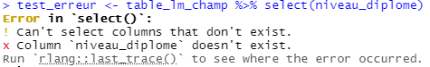{width="300"}

## Récupérer un résultat {.smaller .scrollable}

::: {.callout-note title="Définitions"}
`collect()` constitue une frontière entre le moteur de calcul (spark) et R classique en session Rstudio. Avant `collect()`, les données restent dans le moteur, à distance de la session (au format de `DuckDB` ou de `arrow`). Après `collect()`, le résultat devient un `data.frame` R qu'on peut ouvrir via l'environnement de RStudio et consulter.
:::

Les principales actions sont :

-   `print()` pour afficher un petit résultat comme quelques statistiques descriptives ;

-   `head()` + `collect()` pour lire quelques lignes d'une table ;

-   `sdf_nrow()` pour récupérer le nombre de lignes de la table ;

-   ⚠️ `collect()` pour de petites tables : ne fonctionne pas sur des grosses tables ;

-   `tbl_cache()` pour écrire un `spark_data_frame` temporaire (qui n'est pas consultable comme un `data.frame)`.

::: callout-warning
## Le bouton stop

Il est recommandé de ne pas utiliser ce bouton en programmant en sparklyr : il rend la session spark inutilisable par la suite. Préférez vous placer dans la console et appuyer sur ECHAP pour interrompre un traitement.
:::

## Les erreurs spark {.smaller}

Les erreurs de **programmation** sont soulevées avant que les calculs commencent. Des erreurs peuvent survenir pendant l'exécution du code, quelques minutes après l'appel d'une action par exemple.

::: callout-warning
## Collecter des données trop volumineuses

Une source fréquente d'erreur pendant l'exécution est l'appel d'un `collect()` sur des données trop volumineuses pour être collectées. La première étape du débuggage consiste à limiter les `collect()`.
:::

::: r-stack
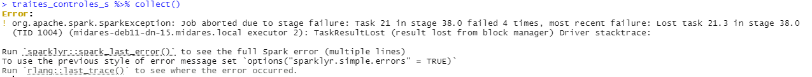{.fragment width="1000" height="100"}

{.fragment width="1000" height="100"}

{.fragment width="1000" height="120"}
:::

::: callout-caution
## Les erreurs sparklyr

Les erreurs envoyées par spark ne sont pas toujours très lisibles, ou très précises sur la nature de l'erreur/sa source. En effet, nous avons vu que les instructions `dplyr` sont en fait traduite en instructions spark natives avant d'être lues et analysées par spark : c'est pourquoi les erreurs relevées sont majoritairement écrites en instructions spark natives.
:::

## Les principales différences syntaxiques {.smaller .scrollable}

La majorité des commandes `dplyr` fonctionnent sur un `spark_data_frame` avec le package `sparklyr`. Les divergences principales sont les suivantes :

+--------------------------------------------------------------------+-------------------+---------------------------------------------------------------------------------------------------------------+
| #### Fonctionnalité                                                | #### `tidyverse`  | #### `sparklyr`                                                                                               |
|                                                                    |                   |                                                                                                               |
| import d'un fichier `.parquet`                                     | `read_parquet`    | `spark_read_parquet()`                                                                                        |
+--------------------------------------------------------------------+-------------------+---------------------------------------------------------------------------------------------------------------+
| tri d'un tableau                                                   | `arrange()`       | `window_order()`                                                                                              |
+--------------------------------------------------------------------+-------------------+---------------------------------------------------------------------------------------------------------------+
| opérations sur les dates                                           | `lubridate`       | [fonctions natives spark SQL](https://spark.apache.org/docs/latest/api/sql/index.html?utm_source=chatgpt.com) |
+--------------------------------------------------------------------+-------------------+---------------------------------------------------------------------------------------------------------------+
| opérations sur les chaînes de caractères et expressions régulières | `stringr`         | [fonctions natives spark SQL](https://spark.apache.org/docs/latest/api/sql/index.html?utm_source=chatgpt.com) |
+--------------------------------------------------------------------+-------------------+---------------------------------------------------------------------------------------------------------------+
| empiler des tableaux                                               | `bind_rows()`     | `sdf_bind_rows()`                                                                                             |
+--------------------------------------------------------------------+-------------------+---------------------------------------------------------------------------------------------------------------+
| nombre de lignes d'un tableau                                      | `nrow()`          | `sdf_nrow()`                                                                                                  |
+--------------------------------------------------------------------+-------------------+---------------------------------------------------------------------------------------------------------------+
| export d'un fichier en parquet                                     | `write_parquet()` | `spark_write_parquet()`                                                                                       |
+--------------------------------------------------------------------+-------------------+---------------------------------------------------------------------------------------------------------------+

## Exemples de traitement de dates {.smaller .scrollable}

Les fonctions de `lubridate()`ne sont pas toutes adaptées au `spark_data_frames`.

-   Convertir une chaîne de caractère de la forme AAAA-MM-DD en Date

```{r}
#| eval: false
#| echo: true

    date_1 <- as.Date("2024-05-26")

```

-   Calculer une durée entre deux dates : `datediff()` plutôt que `-`, `interval()` ou `difftime()`

```{r}
#| eval: false
#| echo: true

    PJC_spark <- spark_read_parquet(sc,
                                    path = "hdfs:///dataset/MiDAS_v4/pjc.parquet",
                                    memory = FALSE)

    duree_pjc_df <- PJC_spark %>%
      rename(date_fin_pjc = as.Date(KDFPJ),
             date_deb_pjc = as.Date(KDDPJ)) %>%
      mutate(duree_pjc = datediff(date_fin_pjc, date_deb_pjc) + 1) %>%
      head(5)

```

-   Ajouter ou soustraire des jours ou des mois à une date : `date_add()`, `date_sub()` et `add_months()`

```{r}
#| eval: false
#| echo: true


    duree_pjc_bis_df <- duree_pjc_df %>%
      mutate(duree_pjc_plus_5 = date_add(duree_pjc, int(5)),
             duree_pjc_moins_5 = date_sub(duree_pjc, int(5)),
             duree_pjc_plus_1_mois = add_months(duree_pjc, int(1))) %>%
      head(5)

```

::: callout-note
## Add_months

Si la date en entrée est le dernier jour d'un mois, la date retournée avec `add_months(date_entree, int(1))` sera le dernier jour calendaire du mois suivant.
:::

::: callout-tip
## Format

Le `int()` est important car ces fonctions Spark SQL n'acceptent que les entiers pour l'ajout de jours : taper uniquement 5 est considéré comme un flottant dans R.
:::

# ❓Quizz ❓ la syntaxe de `sparklyr`

## Question 1 {.smaller .scrollable}

**Que contient un objet `tbl_spark` chargé avec `spark_read_parquet(memory = FALSE)` visible dans l'environnement RStudio ?**

-   A. Toutes les données chargées dans la RAM de R
-   B. Une référence vers une table gérée par Spark
-   C. Seulement les premières lignes de la table
-   D. Un fichier Parquet

. . .

::: {.callout-tip title="Réponse"}
La réponse est B : le chargement des données est paresseux, seules quelques métadonnées sont lues. Spark est ainsi plus adapté que R classique pour les données dont la taille dépasse la RAM.
:::

## Question 2 {.smaller .scrollable}

**Parmi ces opérations, lesquelles sont des transformations lazy ?**

-   A. `filter()`
-   B. `count()`
-   C. `sdf_nrow()`
-   D. `rename()`

. . .

::: {.callout-tip title="Réponse"}
Les bonnes réponses sont A, B et D : elles ne réclament pas la récupération d'un résultat en session R contrairement à `sdf_nrow()`, `collect()`, `print()` etc.
:::

## Question 3 {.smaller .scrollable}

**Que fait `collect()` ?**

-   A. Il transfère l’ensemble de la table source dans Spark
-   B. Il affiche seulement quelques lignes
-   C. Il exécute le traitement et récupère son résultat dans R
-   D. Il conserve le résultat sous forme de table Spark

. . .

::: {.callout-tip title="Réponse"}
La réponse est C : `collect()` transforme le résultat spark en `data.frame` consultable par l'utilisateur. Ainsi, les mêmes contraintes s'appliquent alors sur les ressources qu'en R classique : le résultat collecté doit être suffisamment petit pour tenir dans la mémoire de la session R.
:::

## Question 4 {.smaller .scrollable}

**Quel traitement est adapté à spark ?**

-   

    A.  

```{r}
#| eval: false 
#| echo: true
table %>%
  group_by(departement) %>%
  summarise(total = sum(montant))
```

-   

    B.  

```{r}
#| eval: false 
#| echo: true
table  %>%
  rowwise()  %>%
  mutate(resultat = ma_fonction(montant))
```

-   

    C.  

```{r}
#| eval: false 
#| echo: true
for (i in 1:nrow(table)) {
  # traitement ligne par ligne
}
```

::: {.callout-tip title="Réponse"}
La réponse est A : avec Spark, il faut privilégier les opérations globales plutôt que les traitements R ligne par ligne (C) et on ne peut utiliser que les fonctions traduisibles par le moteur (pas `rowwise()` et `ma_fonction()`, B).
:::

## Pourquoi spark plutôt qu'un autre moteur de calcul ? {.smaller .scrollable}

Jusqu’ici, on a vu que Spark ressemble à d’autres moteurs compatibles avec R (`duckDB`, `arrow`) : syntaxe `dplyr`, format parquet, lecture lazy, transformations, actions. Alors pourquoi choisir spark pour traiter Midas ?

. . .

Spark n’exécute pas seulement le traitement différemment, il l’exécute sur une **infrastructure** différente, le **cluster spark.**

. . .

::: {.callout-note title="La vraie différence n’est pas la syntaxe"}
La différence majeure est l’**infrastructure d’exécution**.

-   `dplyr`, `data.table`, `DuckDB` ou `arrow` travaillent principalement sur **une machine** : votre PC ou un serveur comme la bulle Midares.
-   Spark travaille sur un **cluster** : plusieurs machines (ordinateurs), coordonnées pour traiter les données.
:::

. . .

::: {.callout-important title="Conséquence pour des données volumineuses"}
Avec 700 Go de données et de nombreuses tables à apparier, le problème n’est plus seulement d’écrire un bon code R.

Il faut un moteur capable de :

-   répartir les données en partitions ;
-   répartir les calculs sur plusieurs machines ;
-   optimiser automatiquement le plan de traitement ;
-   éviter de tout charger dans la mémoire de R.
:::

. . .

::: {.callout-important title="Transition"}
Spark n’est donc pas choisi parce que sa syntaxe est plus agréable, mais parce que son mode de fonctionnement est **distribué** et non **local**.
:::

# Le cluster spark : distribution des données 📂

## Quelques définitions informatiques {.smaller .scrollable}

-   Une **machine physique** est un ordinateur réel qui dispose de processeurs, de mémoire RAM et de disque dur.

-   Une **machine virtuelle** ou VM est un ordinateur logiciel hébergé sur une machine physique, qui utilise une partie ou toutes les ressources de l'ordinateur réel sur lequel il est hébergé : ces ressources lui sont réservées.

-   Un **cluster spark** de type yarn est un ensemble de machines physiques connectées en réseau entre elles et capables de se coordonner pour effectuer des traitements spark.

-   Le **système de stockage du cluster spark** s'appelle **HDFS** et est un système de stockage distribué : les données sont partitionnées et leurs partitions sont réparties sont l'ensemble des disques durs des ordinateurs du cluster spark, sans que chaque machine connaisse l'ensemble des données.

Le cluster spark de la bulle Midares contient 15 ordinateurs physiques.

Chaque ordinateur dispose des ressources physiques suivantes :

-   160 Go de RAM

-   8 coeurs

-   un disque dur conséquent

## Le cluster spark Midares {.smaller}

Le cluster spark est accessible via la bulle Midares : il faut d'abord se connecter à la bulle, configurer l'accès au cluster pour la première fois qu'on l'utilise, puis se connecter au cluster via RStudio pour chaque utilisation du cluster spark.

{fig-align="center"}

## Connexion {.smaller}

```{r}
#| eval: false
#| echo: true

library(sparklyr)
library(tidyverse)

# Fichier de configuration Spark

conf <- spark_config()

conf["spark.driver.memory"] <- "16g"                          
conf$spark.driver.maxResultSize <- 0
conf["spark.executor.cores"] <- 2                             
conf["spark.executor.memory"] <- "12g"
conf["spark.executor.memoryOverhead"] <- "5g"
conf["spark.executor.instances"] <- 5
conf["spark.default.parallelism"] <- 20
conf["spark.sql.shuffle.partitions"] <- 200
conf["spark.sql.adaptive.enabled"] <- "true"
conf["spark.sql.adaptive.coalescePartitions.enabled"] <- "true"
conf["spark.sql.adaptive.localShuffleReader.enabled"] <- "true"
conf["spark.sql.adaptive.skewJoin.enabled"] <- "true"
conf["spark.sql.adaptive.skewJoin.skewedPartitionFactor"] <- 2
conf["spark.sql.adaptive.skewJoin.skewedPartitionThresholdInBytes"] <- 64L * 1024L^2
conf["spark.locality.wait"] <- "1s"
sc <- spark_connect(master = "yarn", config = conf)
```

::: callout-important
## Temps de connexion

Pour se connecter au cluster, il faut environ 5 minutes, à chaque connexion. Spark cluster n'est pas du tout adapté à des traitements légers (moins de 10 minutes).
:::

## La distribution des données {.smaller}

Les données sont distribuées sur les noeuds du cluster : chaque noeud ne dispose pas de toutes les données Midas sur son propre disque dur. Chaque morceau de données est répliqué trois fois.

{fig-align="center"}

## Comment consulter les données disponibles sur HDFS {.smaller}

HDFS dispose d'une interface visuelle sur laquelle on peut voir les tables disponibles : la distribution des données est invisible sur cette interface.

::: r-stack
{.fragment fig-align="center" width="900" height="500"}

{.fragment fig-align="center" width="900" height="500"}
:::

## Et mes bases sur la bulle ? {.smaller}

Les données de la bulle Midares ne sont pas enregistrées au même endroit que le cluster.

Il est possible de charger des bases enregistrées n'importe où sur la bulle sur HDFS : depuis vos documents personnels, depuis l'espace commun...

::: r-stack
{.fragment fig-align="center" width="1100" height="450"}

{.fragment fig-align="center" width="1100" height="450"}
:::

## Le stockage distribué avec HDFS {.smaller}

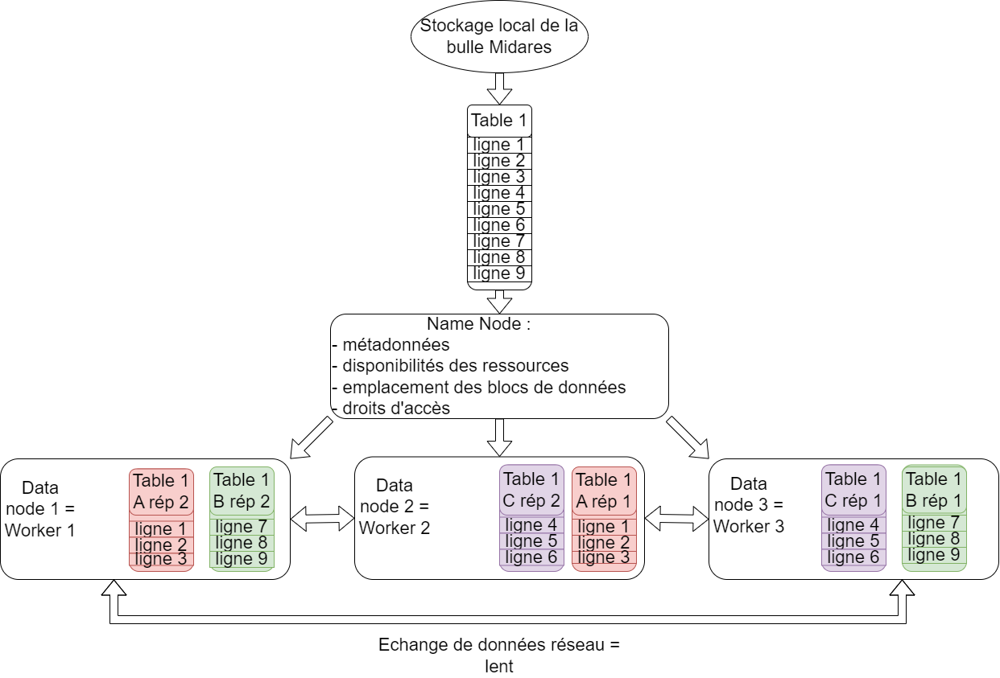{fig-align="center"}

## Chargement des données avec `sparklyr` {.smaller}

```{r}
#| eval: false
#| echo: true

### Depuis HDFS
mmo_17_df_spark <- spark_read_parquet(sc,
                                  path = "hdfs:///dataset/MiDAS_v4/mmo/mmo_2017.parquet",
                                  memory = FALSE)

### Passer un dataframe R en spark
mon_data_frame <- data.frame(c("Anna", "Paul"), c(15, 20))
mon_data_frame_spark <- copy_to(sc, "mon_data_frame")
```

▶️ chargement en mémoire vive couteux en temps : par défaut, `memory = FALSE`

Spark interroge en réalité le NameNode HDFS pour savoir où sont situés les blocs de données de la table mmo_2017, et quelles sont les métadonnées de cette table. Chaque exécuteur a accès aux morceaux de données présents sur le disque dur du noeud sur lequel il est hébergé.

::: callout-tip
## Spark data frames

`mmo_17_df_spark` est un spark data frame (sdf) : il ne peut pas être ouvert comme un data frame R classique, il n'est pas dans la session R, il reste dans tous les cas côté cluster.
:::

## Exporter des données depuis Spark vers HDFS {.smaller}

Après un traitement Spark, le résultat peut être **exporté sur HDFS** sans être rapatrié dans la session R.

```{r}
#| eval: false
#| echo: true

resultat_spark %>%
  spark_write_parquet(
    path = "hdfs:///votre_dossier/resultat_final",
    mode = "overwrite"
  )
```

::: {.callout-tip title="A retenir"}
Exporter avec `spark_write_parquet()` écrit le résultat côté cluster, dans HDFS.

Cela permet de conserver une table produite par Spark sans utiliser `collect()`.
:::

::: {.callout-warning title="Attention"}
`mode = "overwrite"` remplace les données déjà présentes dans le dossier cible.

L’export déclenche une action Spark : le plan de traitement est réellement exécuté au moment de l’écriture.
:::

`spark_write_parquet()` sert bien à écrire une table en Parquet, avec un chemin pouvant être en `hdfs://`.

## Télécharger des données en local {.smaller}

Il est également possible de transférer des données de HDFS vers la bulle en les téléchargeant : c'est utile par exemple quand on a créé notre table finale avec spark et qu'on veut utiliser un package d'économétrie sur la bulle en local.

::: r-stack
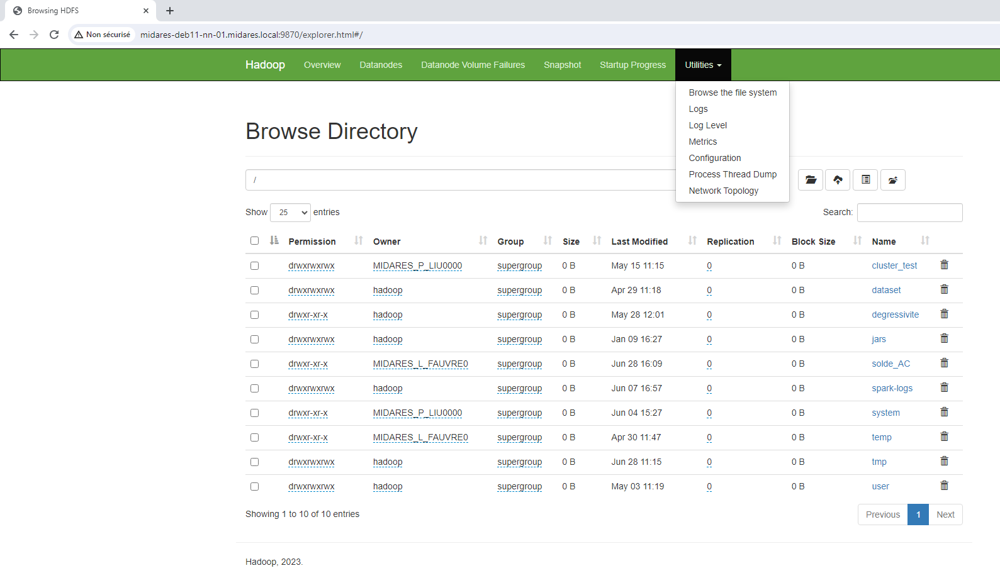{.fragment width="1000" height="700"}

{.fragment}
:::

# ❓ Quiz — La distribution des données dans Spark

## Question 1 — Données locales ou données sur cluster {.smaller .scrollable}

**Quelle est la différence entre une donnée stockée dans la bulle Midares et une donnée stockée dans HDFS ?**

-   A. Une donnée dans la bulle Midares est stockée sur l’environnement de travail RStudio
-   B. Une donnée dans HDFS est répartie sur plusieurs nœuds du cluster
-   C. Une donnée dans HDFS est nécessairement chargée dans la RAM de R
-   D. Une donnée dans la bulle Midares est automatiquement distribuée sur le cluster

. . .

::: {.callout-tip title="Réponse"}
Les bonnes réponses sont **A et B**.

La bulle Midares correspond à l’environnement depuis lequel on lance le code. HDFS correspond au stockage distribué du cluster : les fichiers y sont découpés et répartis entre plusieurs nœuds.
:::

## Question 2 — Lecture paresseuse des données {.smaller .scrollable}

**Quand on lit une table Parquet avec `spark_read_parquet(memory = FALSE)`, que se passe-t-il ?**

-   A. La table entière est chargée dans la RAM de R
-   B. Spark crée une table distante qui référence les fichiers Parquet
-   C. Les traitements seront réellement exécutés lorsqu’une action demandera un résultat
-   D. Toutes les données sont immédiatement copiées dans la bulle Midares

. . .

::: {.callout-tip title="Réponse"}
Les bonnes réponses sont **B et C**.

La lecture crée une table Spark liée aux fichiers Parquet, sans rapatrier toute la table dans R. Les transformations restent lazy : Spark construit un plan de traitement, puis l’exécute lorsqu’une action demande un résultat.
:::

## Question 3 — Le rôle du NameNode {.smaller .scrollable}

**Que contient principalement le NameNode HDFS ?**

-   A. Toutes les données des fichiers HDFS
-   B. Les métadonnées des fichiers et l’emplacement de leurs blocs
-   C. Les résultats des traitements Spark
-   D. Les ressources en RAM et en processeurs du cluster

. . .

::: {.callout-tip title="Réponse"}
La réponse est **B**.

Le NameNode connaît l’organisation des fichiers et l’emplacement de leurs blocs, mais il ne stocke pas les données elles-mêmes.
:::

## Question 4 — Le rôle des DataNodes {.smaller .scrollable}

**Où les données HDFS sont-elles réellement stockées ?**

-   A. Sur les disques des différents DataNodes
-   B. Dans la RAM du driver Spark
-   C. Dans la session RStudio
-   D. Sur le disque de la bulle Midares

. . .

::: {.callout-tip title="Réponse"}
La réponse est **A**.

Les fichiers sont découpés en blocs répartis sur les disques des différents nœuds du cluster. Les services DataNode permettent de lire et d’écrire ces blocs.
:::

## Question 5 — Les partitions Spark {.smaller .scrollable}

**Qu’est-ce qu’une partition Spark ?**

-   A. Une copie complète de la table
-   B. Une portion des données pouvant être confiée à une tâche Spark
-   C. Une machine physique du cluster
-   D. Un fichier obligatoirement stocké sur un seul DataNode

. . .

::: {.callout-tip title="Réponse"}
La réponse est **B**.

Spark découpe les données en partitions afin de pouvoir traiter plusieurs portions de la table en parallèle.

Une partition Spark ne correspond pas nécessairement exactement à un fichier Parquet, à un dossier de partitionnement Parquet ou à un bloc HDFS. C'est un objet de type spark.
:::

# Le cluster spark : distribution des traitements ⏳

## Le driver en sparklyr {.smaller}

{fig-align="center" width="400"}

-   Le programme R est traduit en Spark SQL grâce aux packages `sparklyr` et `dbplyr` dans la session R.

-   Le driver traduit le programme SQL en instruction spark : un plan logique de traitement.

-   S'il remarque une erreur, l'erreur est envoyée directement à l'utilisateur en session R avant l'exécution du programme : c'est la force de la lazy evaluation.

## Le driver optimise le programme {.smaller}

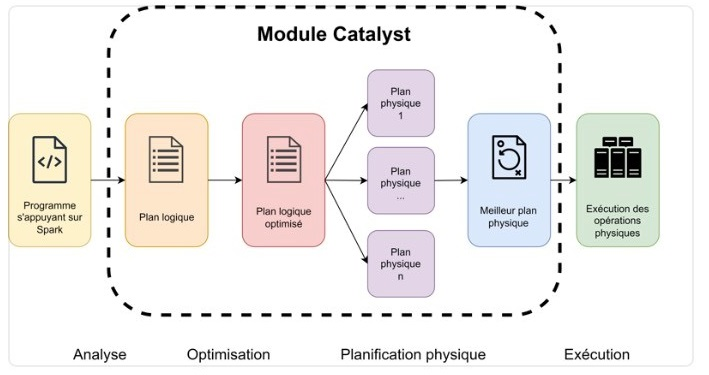

source : documentation CASD

## Le driver optimise le programme {.smaller}

Spark optimise automatiquement les programmes soumis :

1.  Compilation des transformations pour soulever les éventuelles erreurs.

2.  Intégration dans un **plan logique d'exécution** contenant les étapes nécessaires pour parvenir au résultat demandé par le programme.

3.  Optimisation du plan logique par le module **Catalyst** (driver Spark).

## Le driver optimise le programme {.smaller .scrollable}

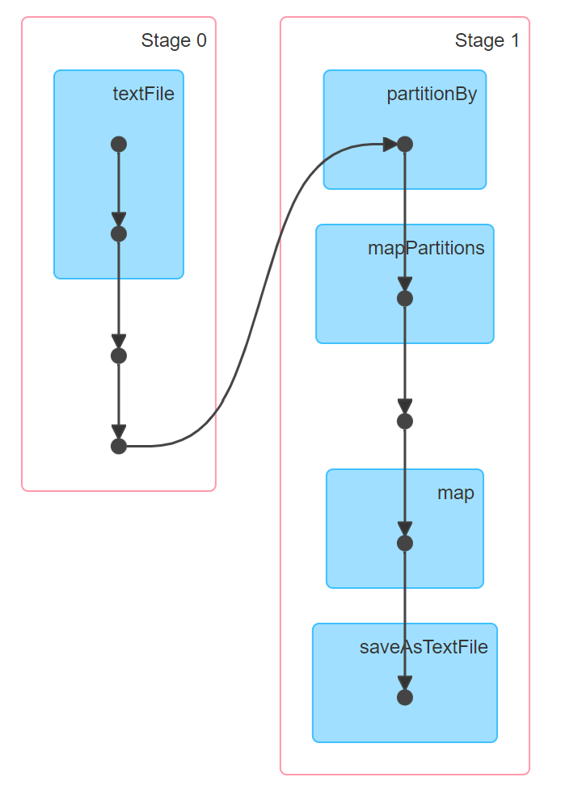{fig-align="center"}

## Le driver optimise le programme {.smaller}

Par exemple si j'écris le programme :

```{r}
#| eval: false 
#| echo: true  

non_optimal <- table_1 %>%   
    mutate(duree_contrat = DATEDIFF(fin_contrat, debut_contrat)) %>%   
    filter(debut_contrat >= as.Date("2023-01-01"))
```

<br>

Catalyst réécrit :

<br>

```{r}
#| eval: false 
#| echo: true  

optimal <- table_1 %>%   
    filter(debut_contrat >= as.Date("2023-01-01")) %>%   
    mutate(duree_contrat = DATEDIFF(fin_contrat, debut_contrat))
```

Cette optimisation est réalisée sur toutes les transformations compilées avant qu'une action déclenche l'exécution.

## Le driver optimise le programme {.smaller}

Le driver n'optimise que les transformations comprises entre des actions : à partir de l'action, spark ne lit pas la suite du programme.

Pour profiter des avantages de spark, la manière de programmer recommandée est différente de celle prédominante en R classique. On évite quoi ?

. . .

On évite :

-   de mettre des `collect()`sur chaque table intermédiaire

-   de `collect()` une table entière

-   de `print()` à chaque étape

. . .

Sinon Catalyst ne voit pas la suite du code et ne peut pas l'optimiser.

## Le driver optimise le programme {.smaller}

```{r}
#| eval: false 
#| echo: true  

non_optimal <- table_1 %>% 
    collect() %>%
    mutate(duree_contrat = DATEDIFF(fin_contrat, debut_contrat)) %>%   
    filter(debut_contrat >= as.Date("2023-01-01"))

```

. . .

versus

```{r}
#| eval: false 
#| echo: true  

optimal <- table_1 %>%
    mutate(duree_contrat = DATEDIFF(fin_contrat, debut_contrat)) %>%   
    filter(debut_contrat >= as.Date("2023-01-01")) %>%
    head(5) %>% 
    collect()

```

## La longueur du plan logique {.smaller}

Fournir un plan logique très long sans déclencher d'action peut créer une erreur en spark : spark "refuse" d'optimiser un plan si long.

La bonne pratique consiste à "cacher" des résultats intermédiaires, pour déclencher l'exécution régulièrement et conserver les résultats en mémoire, tout en nettoyant la mémoire des résultat intermédiaires précédents :

```{r}
#| eval: false
#| echo: true

table_1 <- mon_champ %>%
  left_join(table_2) %>%
  mutate(variable_1 = indicatrice_1 + indicatrice_2,
         regroupement_variable_2 = case_when(variable_2 %in% c(1,2,3) ~ "A",
                                             variable_2 %in% c(5,8,9) ~ "B",
                                             TRUE ~ "C")) %>%
  left_join(table_3) %>%
  sdf_register("table_1")

tbl_cache(sc, "table_1")

table_4 <- table_1 %>%
  left_join(table_5) %>%
  mutate(variable_y = ifelse(variable_x > 50, 1, 0)) %>%
  sdf_register("table_4")

tbl_cache(sc, "table_4")

tbl_uncache(sc, "table_1")
```

## Le driver distribue les traitements {.smaller .scrollable}

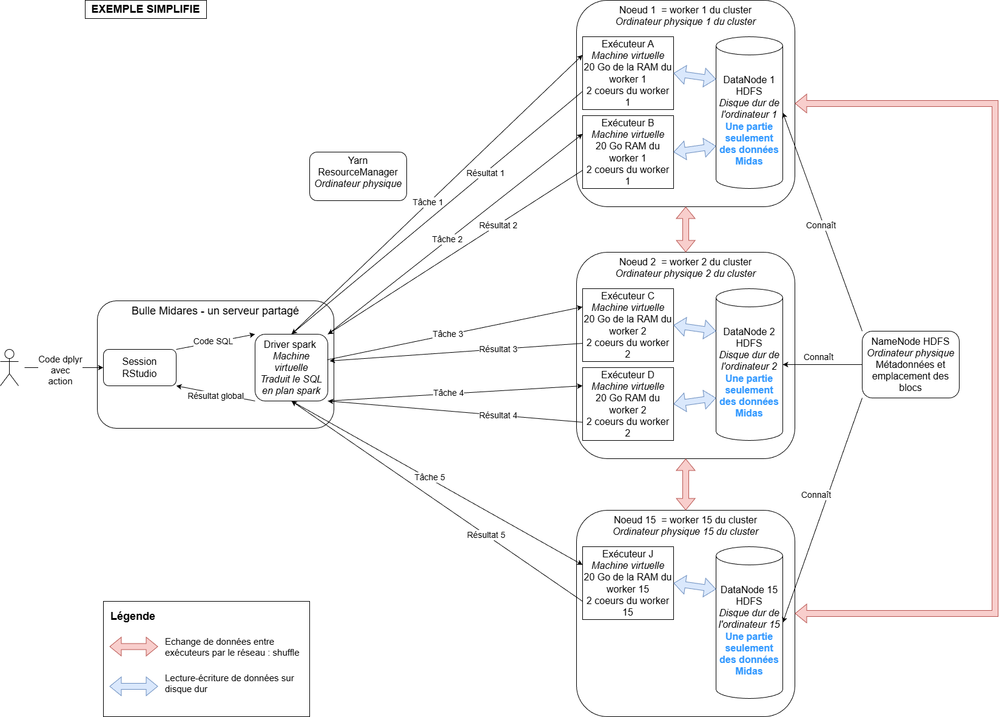{fig-align="center"}

## Le driver distribue les traitements {.smaller}

Le driver ne se contente pas d’optimiser le plan logique : il le transforme ensuite en **plan physique**.

Ce plan physique indique concrètement :

-   quelles tâches doivent être exécutées ;
-   sur quelles morceaux de données appelés partitions de données ;
-   par quels exécuteurs ;
-   dans quel ordre.

. . .

::: {.callout-note title="Data locality"}
Spark essaie autant que possible d’envoyer les tâches près des données.

Si un bloc HDFS est présent sur le nœud 1, Spark cherchera à faire exécuter la tâche par un exécuteur situé sur ce même nœud.

Objectif : limiter les lectures à distance et les transferts réseau de données, longs et coûteux en ressources.
:::

## Le rôle de l'exécuteur {.smaller}

L'exécuteur effectue le morceau de programme qu'on lui affecte :

-   il ne connaît que les tâches qu'on lui a affectées ;

-   il peut communiquer avec le driver en réseau pour renvoyer un résultat ;

-   il peut communiquer avec les autres workers en réseau pour partager des données ou des résultats intermédiaires : c'est un shuffle.

Le calcul n'est pas seulement distribué, il est **parallèle** : chaque exécuteur travaille en parallèle des autres, d'où l'efficience de spark.

::: callout-important
Le partage de données entre exécuteurs est lent : c'est un échange via le réseau. Il est important d'identifier les opérations qui nécessitent un shuffle de celles qui n'en impliquent pas.
:::

## Traitement MAP distribué {.smaller}

Un traitement MAP n'implique pas de shuffle. C'est le traitement parallèle par excellence : l'exécuteur peut effectuer la totalité du traitement commandé par le driver sans interragir ou attendre des données des autres exécuteurs.

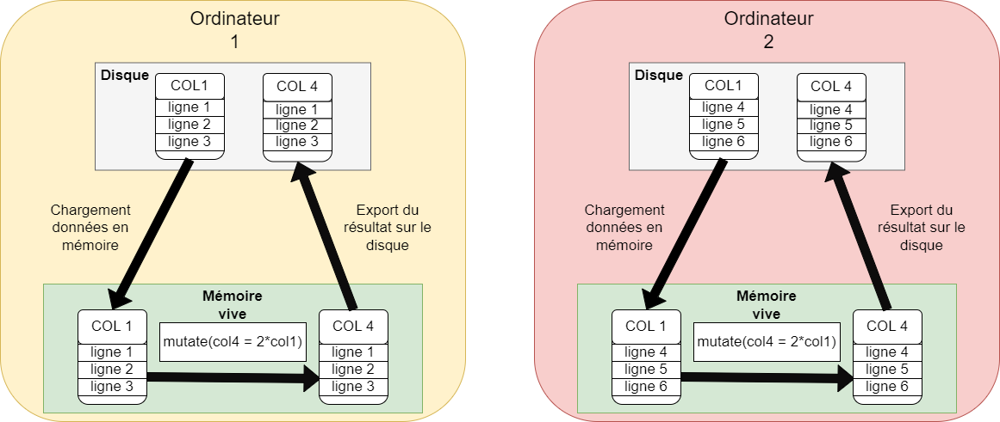{fig-align="center"}

## Traitement REDUCE distribué

Les traitements REDUCE impliquent des shuffles.

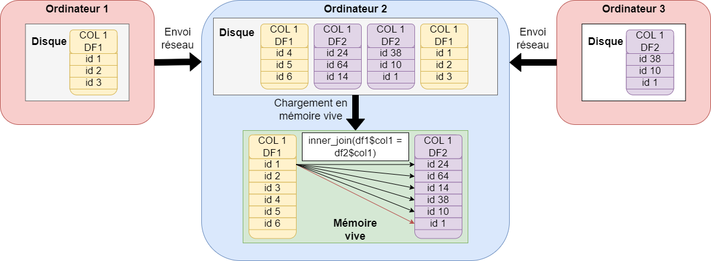{fig-align="center"}

## Le shuffle

{fig-align="center"}

## Quelles opérations provoquent souvent un shuffle ? {.smaller .scrollable}

Un **shuffle** apparaît lorsque Spark doit redistribuer les lignes entre exécuteurs pour réunir les données nécessaires au même endroit.

. . .

::: {.callout-warning title="Opérations souvent coûteuses"}
-   `group_by()` + `summarise()`\
    → regrouper toutes les lignes d’un même groupe

-   `left_join()`, `inner_join()`, etc.\
    → réunir les lignes ayant la même clé de jointure

-   `distinct()`\
    → comparer les lignes pour supprimer les doublons

-   `arrange()`\
    → trier globalement les données

-   `repartition()`\
    → changer volontairement la répartition des données
:::

. . .

::: {.callout-note title="À retenir"}
Un shuffle n’est pas interdit, mais il est coûteux : il implique des échanges réseau, des écritures temporaires sur disque et parfois beaucoup de mémoire.

Il faut donc éviter les shuffles inutiles, surtout les tris ou dédoublonnages de confort.
:::

## Calcul distribué, calcul vectoriel : boucles for {.smaller}

<br>

Cas d'usage : je veux repérer si un groupe d'individus est au RSA un mois, deux mois, trois mois etc. après la sortie de l'assurance-chômage

J'utilise :

-   le FNA, dont j'extraie une table individu avec le mois de sortie de l'assurance-chômage, table `sorties`

-   les tables mensuelles de la CNAF `cnaf_prestations_mois_m`

## Calcul distribué, calcul vectoriel : boucles for {.smaller .scrollable}

::: panel-tabset
### Solution 1

Lance 12 X tous les mois de sortie jobs spark, beaucoup de shuffles

```{r}
#| eval: false
#| echo: true

library(dplyr)
library(sparklyr)

res_all <- NULL

for (mois in mois_sortie_vec) { # 1ère boucle sur les mois de sorties
  # Sous-ensemble des sortants de ce mois
  sorties_mois <- sorties %>%
    filter(mois_sortie == !!mois) %>%
    select(id, mois_sortie)

  for (h in 1:12) { # 2ème boucle sur les 12 mois d'horizon
    
    mois_cible <- as.Date(mois) + months(h)
    nom_tbl <- paste0("cnaf_prestations_", format(mois_cible, "%Y_%m"))
    table_mois_cnaf <- spark_read_parquet(paste0(chemin_table, nom_tbl))

    perception_RSA_mois_h <- sorties_mois %>%
      mutate(mois_h = sql(paste0("add_months(mois_sortie, ", h, ")"))) %>%
      inner_join(table_mois_cnaf, by = c("id" = "id", "mois_h" = "mois")) %>%
      mutate(perception_RSA = ifelse(RSAVERS == "C" & MTRSAVER > 0, 1, 0)) %>%
      transmute(id, mois_sortie, h = !!h, perception_RSA)

    # empiler et mettre en cache le résultat
    res_all <- if (is.null(res_all)) perception_RSA_mois_h else sdf_bind_rows(res_all, perception_RSA_mois_h) %>% sdf_register(paste0("temp", mois, h))
  tbl_cache(sc, paste0("temp", mois, h))
  }
}

```

### Solution 2

Lance 12 jobs et une action à chaque tour

```{r}
#| eval: false
#| echo: true

for (mois in liste_mois) {
  
  nom_tbl <- paste0("cnaf_prestations_", format(mois, "%Y_%m"))
  table_mois_cnaf <- spark_read_parquet(paste0(chemin_table, nom_tbl))

  # Jointure globale, calcul de l'horizon h 
  perception_RSA_mois <- table_mois_cnaf %>%
    inner_join(sorties, by = "id") %>%
    mutate(h = sql("cast(months_between(mois, mois_sortie) as int)")) %>%
    filter(h >= 1, h <= 12) %>%
    select(id, mois_sortie, h, prest)

  # Cache pour enregistrer le résultat en mémoire
  perception_RSA_mois_cache <- perception_RSA_mois %>% sdf_register(paste0("temp", mois))
  tbl_cache(sc, paste0("temp", mois))

  res_stack <- if (is.null(res_stack)) joined_cached else sdf_bind_rows(res_stack, joined_cached)
}
```

### Solution 3

Meilleure solution : un seul plan logique que Catalyst peut entièrement optimsier, en limitant les shuffles, beaucoup plus rapide

```{r}
#| eval: false
#| echo: true


# Charger la première table CNAF
nom_1 <- paste0("cnaf_prestations_", format(as.Date("2023-01-01"), "%Y_%m"))
cnaf_total <- spark_read_parquet(paste0(chemin_table, nom_1))

# Empiler les autres
for (mois in liste_mois) {
  
  nom_tbl <- paste0("cnaf_prestations_", format(mois, "%Y_%m"))
  table_mois_cnaf <- spark_read_parquet(paste0(chemin_table, nom_tbl))
  
  cnaf_total <- sdf_bind_rows(cnaf_total, table_mois_cnaf) %>%
    sdf_register("cnaf_total")
  tbl_cache(sc, "cnaf_total")
}


# Joindre UNE fois avec la table des sorties (broadcast si petit)
sorties_b <- sdf_broadcast(sorties %>%
  select(id, mois_sortie)
)

perception_RSA_horizon <- cnaf_total %>%
  inner_join(sorties_b, by = "id") %>%
  mutate(
    h = sql("cast(months_between(mois, mois_sortie) as int)")
  ) %>%
  filter(h >= 1, h <= 12) %>%
  select(id, mois_sortie, h, prest)

```
:::

## Calcul distribué, calcul vectoriel : jointures {.smaller}

Une **jointure** implique pour spark de rappatrier les lignes avec les mêmes valeurs de clef sur le même worker : les jointures engendrent des **shuffles**.

<br>

Lorsque l’on joint une **grosse table** avec une **petite table**, Spark peut optimiser le calcul en utilisant un **broadcast join** : la petite table est **diffusée en entier** sur chaque worker, ce qui évite un shuffle massif.

```{r}
#| eval: false
#| echo: true

res <- grosse_table %>%
  inner_join(sdf_broadcast(petite_table), by = "clef")
```

<br>

👉 Ici petite_table est diffusée (broadcast) sur tous les workers : chaque partition de grosse_table fait alors le join localement, sans transfert réseau coûteux.

## Calcul distribué, calcul vectoriel : jointures {.smaller}

**Broadcast automatique** : par défaut, Spark choisit automatiquement le broadcast join si la table à diffuser fait moins de 10 MB (paramètre configurable).

Au-delà, il utilise un **shuffle join** classique (plus lent).

👉 Bonne pratique : forcer avec `sdf_broadcast()` quand on sait que la table est petite, plutôt que de compter sur ce comportement implicite.

## Calcule distribué, calcul vectoriel {.smaller}

+----------------------------------------+------------------------------------------------------+--------------------------------------------------------------------+
| **Opération logique**                  | **Solution non vectorielle**                         | **Solution vectorielle**                                           |
+========================================+======================================================+====================================================================+
| situation à m + 1, 2...                | Boucle for sur les mois                              | utilisation de `lag()` et `lead()`, ou auto jointure sur les dates |
+----------------------------------------+------------------------------------------------------+--------------------------------------------------------------------+
| Répéter une fonction                   | user defined functions (UDF)                         | éviter les UDF                                                     |
+----------------------------------------+------------------------------------------------------+--------------------------------------------------------------------+
| opération groupe de lignes             | `group_by %>% mutate %>% distinct`                   | `group_by %>% summarise`                                           |
+----------------------------------------+------------------------------------------------------+--------------------------------------------------------------------+
| joindre petite table avec grosse table | `petite_table %>% left_join(grosse_table)`           | broadcast join                                                     |
+----------------------------------------+------------------------------------------------------+--------------------------------------------------------------------+
| joindre deux grosses tables            | boucle for en divisant les tables en petits morceaux | unique jointure et partition par la clef de jointure               |
+----------------------------------------+------------------------------------------------------+--------------------------------------------------------------------+
| construire un panel cylindré           | boucle for                                           | `cross_join()` de deux tables                                      |
+----------------------------------------+------------------------------------------------------+--------------------------------------------------------------------+

# ❓ Quiz — La distribution des traitements dans Spark

## Question 1 — Le rôle du driver {.smaller .scrollable}

**Quel est le rôle principal du driver Spark ?**

-   A. Stocker les blocs des fichiers HDFS
-   B. Construire les plans d’exécution et distribuer les tâches aux exécuteurs
-   C. Exécuter lui-même toutes les opérations sur les données
-   D. Remplacer la session RStudio

. . .

::: {.callout-tip title="Réponse"}
La réponse est **B**.

Le driver coordonne l’application Spark : il construit les plans de traitement, organise les calculs et envoie les tâches aux exécuteurs.
:::

## Question 2 — Le rôle des exécuteurs {.smaller .scrollable}

**Quelles affirmations décrivent correctement un exécuteur Spark ?**

-   A. Il exécute les tâches envoyées par le driver
-   B. Il traite les partitions de données qui lui sont confiées
-   C. Il traduit le code `dplyr` en Spark SQL dans la session R
-   D. Il est un ordinateur physique

. . .

::: {.callout-tip title="Réponse"}
Les bonnes réponses sont **A et B**.

Un exécuteur est un processus situé sur un noeud worker : le noeud worker est l'ordinateur physique, l'exécuteur est virtuel et n'occupe qu'une partie des ressources du noeud sur lequel il est hébergé. Il exécute les tâches Spark sur les partitions qui lui sont confiées.
:::

## Question 3 — Plan de traitement {.smaller .scrollable}

**Que cherche à déterminer le driver spark lors de la construction du plan de traitement ?**

-   A. Les opérations logiques à exécuter
-   B. Les éventuelles erreurs de code
-   C. Le nombre de lignes que RStudio peut afficher dans l’environnement
-   D. Le placement des tâches au plus près des données (sur les noeuds) lorsque cela est possible

. . .

::: {.callout-tip title="Réponse"}
Les bonnes réponses sont **A, B et C**.

Les opérations logiques sont ordonnées dans un plan logique.

Ensuite, le driver construit le plan physique qui décrit comment le traitement sera exécuté. Spark découpe ensuite ce traitement en tâches et cherche, lorsque cela est possible, à exécuter les calculs sur les noeuds proches des données.

Cette recherche de proximité est appelée **data locality**.
:::

## Question 4 — Les shuffles {.smaller .scrollable}

**Quelles opérations peuvent souvent provoquer un shuffle ?**

-   A. `distinct()`
-   B. `select()`
-   C. `group_by()` suivi de `summarise()`
-   D. Une jointure entre deux grandes tables
-   E. `filter()`
-   F. Un tri global avec `arrange()`

. . .

::: {.callout-tip title="Réponse"}
Les bonnes réponses sont **C, D, E et F**.

Ces opérations peuvent obliger Spark à redistribuer les lignes entre les exécuteurs afin de réunir au même endroit les données ayant une même clé ou devant être comparées.

Ce transfert de données intermédiaires entre exécuteurs est appelé un **shuffle**. Il implique généralement des échanges réseau et des écritures temporaires sur disque.
:::

## Question 5 — Programmer pour un traitement distribué {.smaller .scrollable}

**Pourquoi faut-il privilégier des opérations globales et traduisibles par Spark ?**

-   A. Elles permettent à Spark d’optimiser et de distribuer automatiquement le traitement
-   B. Elles obligent le driver à traiter chaque ligne séparément
-   C. Elles évitent les traitements R ligne par ligne et les successions inutiles de jobs
-   D. Elles garantissent qu’aucun shuffle ne se produira jamais

. . .

::: {.callout-tip title="Réponse"}
Les bonnes réponses sont **A et C**.

Avec Spark, il faut décrire le traitement sur un ensemble de lignes et laisser le moteur organiser son exécution sur les partitions.

Les boucles lançant de nombreux jobs, `rowwise()` et les fonctions R personnalisées appliquées ligne par ligne empêchent Spark de profiter pleinement de son optimisation et de son exécution distribuée.

Une opération globale peut néanmoins provoquer un shuffle : elle n’est donc pas toujours gratuite.
:::

# Quelques bonnes pratiques 🤝

## La mémoire du driver

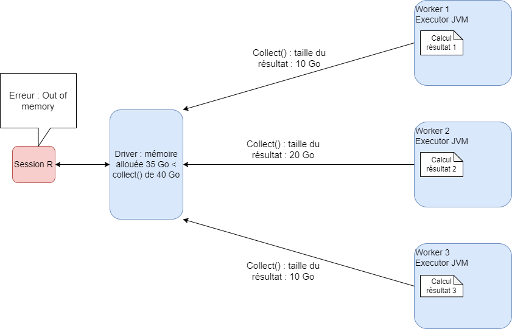{fig-align="center"}

## Programmer sans collecter {.smaller}

La programmation en spark doit être adaptée aux contraintes de volumétrie des données.

La principale différence avec la programmation en R classique est que **la visualisation de tables complètes volumineuses n'est pas toujours possible et n'est pas recommandée** :

-   **goulets d'étranglement** même avec spark, car toutes les données sont rapatriées vers le driver puis vers la session R : erreurs Out of Memory

-   **longue :** échange entre tous les noeuds impliqués dans le calcul et le driver, puis un échange driver-session R en réseau = lent ;

-   **beaucoup moins efficace que l'export direct en parquet** du résultat (qui fonctionne toujours) : charger ensuite sa table finale en data frame R classique pour effectuer l'étude.

## Je veux voir ma table {.smaller}

1.  Vérifier le nombre de lignes sans collecter

```{r}
#| eval: false
#| echo: true

ma_table %>% 
  sdf_nrow()

```

. . .

2.  Vérifier la présence de doublons

```{r}
#| eval: false
#| echo: true

nb_doublons <- ma_table %>% 
  group_by(id_midas) %>%
  summarise(nb_ligne_ind = n()) %>%
  ungroup() %>%
  filter(nb_ligne_ind > 1) %>%
  sdf_nrow()

```

. . .

3.  Récupérer une partie de la table : pas plus de 500 lignes

```{r}
#| eval: false
#| echo: true

une_partie_de_ma_table <- ma_table %>% 
  head(100) %>%
  collect()


une_partie_de_ma_table <- ma_table %>% 
  filter(id_midas %in% ma_liste_id_midas) %>%
  collect()

# une_partie_de_ma_table est ici un data.frame R classique que vous pouvez ouvrir!
```

## Exporter des données sur disque {.smaller}

Sur la pause déjeuner par exemple.

Export des spark data frames directement sous HDFS : à aucun moment on n'ouvre la table : on peut traiter des données beaucoup plus volumnieuses que la mémoire RAM !

```{r}
#| eval: false
#| echo: true

ma_table_spark <- MMO %>%
  
  right_join(mon_champ_individuel, by = c("id_midas")) %>%
  
  mutate(fin_ctt_bis = ifelse(is.na(FinCTT), as.Date("2023-12-31"), FinCTT)) %>%
  
  mutate(duree_ctt = DATEDIFF(FinCTT, DebutCTT) + 1) 

spark_write_parquet(ma_table_spark, "hdfs:///resultats/ma_table.parquet")

```

Possibilité de récupérer ce fichier sur la bulle MiDARES = en local.

## Exporter des données sur disque {.smaller}

::: callout-caution
## Les exports sur HDFS

Lorsqu'on exporte une table depuis notre session R vers HDFS, celle-ci est **automatiquement partitionnée**, comme le reste des données.

Ainsi, cette table sera stockée en plusieurs morceaux sous HDFS et répliquée.

Il est possible de maîtriser le nombre de partitions avec la commande `sdf_coalesce(partitions = 1)` du package `sparklyr`.

Avec `sdf_coalesce(partitions = 1)`, on n'aura qu'un seul fichier à télécharger depuis HDFS. L'export est beaucoup plus rapide.

Avec `sdf_coalesce(partitions = 200)`, on aura 200 morceaux de notre fichier à télécharger à la main (pas possible de faire tout sélectionner sous HDFS !).
:::

```{r}
#| eval: false
#| echo: true

ma_table <- data.frame(c("Anne", "Paul"), c(25,30))

ma_table_spark <- copy_to(sc, ma_table) %>%
  sdf_coalesce(partitions = 1)

spark_write_parquet(ma_table_spark, "hdfs:///resultats/ma_table.parquet")
```

## Fermer sa session {.smaller}

Il faut impérativement fermer sa session spark après une session de travail. Deux moyens pour ça :

-   fermer R Studio

-   si on ne ferme pas RStudio, utiliser la fonction `spark_disconnect_all()` dans son code

Si on souhaite lancer un code le soir en partant, on n'oublie pas le `spark_disconnect_all()` à la fin du code.

::: callout-warning
## Partage des ressources

Les ressources réservées par un utilisateur ne sont libérées pour les autres que lorsqu'il se déconnecte. Ne pas se déconnecter, c'est bloquer les ressources.

Nous fermerons les sessions ouvertes trop longtemps (départ de congés sans déconnexion) si des utilisateurs présents en ont besoin : risque de perte du travail non enregistré.
:::

## Programmer de manière adaptée au calcul distribué : conclusion {.smaller}

Pour programmer en spark de manière optimale :

1.  Programmer de manière vectorielle : pas de boucles for, pas de tri inutile

2.  Déclencher une action après plusieurs transformations pour laisser Catalyst optimiser, mais pas après un trop gros nombre de transformations pour éviter une erreur

3.  Ne pas collecter tout une table

4.  Persister ou cacher une table qu'on va appeler plusieurs fois ou pour déclencher une action intermédiaire

5.  Exporter les tables intermédiaires volumineuses en 10 partitions, et les tables finales en 1 seule partition

## Et ensuite ? {.smaller}

Spark est un outil de traitement de données volumineuses. Il n'est pas adapté **pour faire de l'économétrie** : tous les packages R ne sont pas traduits en spark. **Conseils :**

1.  Créer sa table d'étude en appariant les tables de MiDAS avec le cluster spark

2.  L'exporter sous HDFS

3.  La télécharger en local

4.  La charger en R classique pour faire de l'économétrie

## Les bonnes pratiques 🤝 {.smaller}

1.  Ne jamais modifier la configuration fournie

2.  Consulter les tutoriels pratiques sur la bulle

3.  Consulter les fiches de la documentation Midas 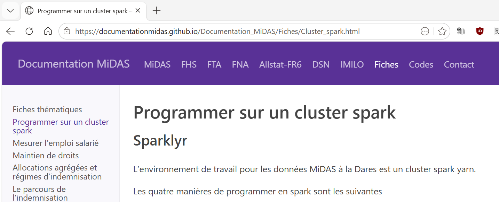{fig-align="center"}

# ❓ Quiz — Bonnes pratiques sur cluster YARN

## Question 1 — Libérer les ressources {.smaller .scrollable}

**Que faut-il faire à la fin d’une session de travail Spark ?**

-   A. Laisser la session ouverte au cas où
-   B. Fermer la connexion Spark avec `spark_disconnect(sc)`
-   C. Arrêter les traitements inutiles
-   D. Collecter toutes les tables avant de quitter
-   E. Fermer la connexion Spark en fermant RStudio

. . .

::: {.callout-tip title="Réponse"}
Les bonnes réponses sont **B, C et E**.

Sur un cluster partagé, une session Spark ouverte continue à réserver des ressources. Il faut donc libérer les ressources dès qu’on n’en a plus besoin.
:::

## Question 2 — Configuration recommandée {.smaller .scrollable}

**Peut-on modifier librement la configuration Spark recommandée ?**

-   A. Oui, pour obtenir plus de RAM et plus de cœurs
-   B. Oui, si le traitement échoue une première fois
-   C. Non, sauf consigne ou validation explicite
-   D. Non, car le cluster est partagé et les ressources doivent rester équilibrées entre utilisateurs

. . .

::: {.callout-tip title="Réponse"}
Les bonnes réponses sont **C et D**.

Sur un cluster YARN partagé, demander trop de mémoire ou trop de cœurs peut pénaliser les autres utilisateurs, créer de l’attente ou provoquer des échecs d’allocation. On utilise donc la configuration recommandée, sauf besoin justifié et validé. La configuration a été testée par l'équipe en charge du cluster : elle est adaptée pour des traitements lourds sur les données Midas.
:::

## Question 3 — Erreur Out Of Memory {.smaller .scrollable}

**En cas d’erreur mémoire, quelles sont les bonnes premières réactions ?**

-   A. Vérifier qu’on ne fait pas un `collect()` trop tôt ou sur une table trop grosse
-   B. Réduire le volume avant les opérations coûteuses : `select()`, `filter()`, agrégation
-   C. Vérifier les jointures qui peuvent multiplier le nombre de lignes
-   D. Augmenter soi-même fortement la mémoire des exécuteurs
-   E. Découper ou matérialiser des étapes intermédiaires avec `tbl_cache()` voire un export parquet intermédiaire si le pipeline est trop lourd

. . .

::: {.callout-tip title="Réponse"}
Les bonnes réponses sont **A, B, C et E**.

Une erreur mémoire ne se règle pas en demandant plus de ressources. Il faut d’abord chercher à réduire la taille des données traitées, éviter les `collect()` inutiles, contrôler les jointures et simplifier le plan de traitement.
:::

## Question 4 — `collect()` sur cluster {.smaller .scrollable}

**Quelle est la bonne utilisation de `collect()` ?**

-   A. Collecter la table source complète pour travailler ensuite en R
-   B. Collecter seulement un résultat réduit et exploitable localement
-   C. Collecter après avoir filtré, sélectionné et agrégé dans Spark
-   D. Collecter uniquement quelques lignes pour vérifier chaque étape du pipeline

. . .

::: {.callout-tip title="Réponse"}
Les bonnes réponses sont **B, C** **et D**.

`collect()` ramène le résultat dans la session R. Il faut donc l’utiliser uniquement lorsque le résultat est suffisamment petit pour tenir en mémoire locale.
:::

## Question 5 — Déclencher des actions {.smaller .scrollable}

**Quand faut-il déclencher une action Spark ?**

-   A. Après chaque ligne de code pour vérifier immédiatement
-   B. Jamais avant la toute fin, même si le pipeline devient très long
-   C. À des moments stratégiques pour vérifier, matérialiser ou récupérer un résultat
-   D. Avec `compute()` lorsqu’on veut exécuter une étape intermédiaire tout en gardant le résultat côté Spark
-   E. Avec `collect()` lorsqu’on veut récupérer un petit résultat final dans R

. . .

::: {.callout-tip title="Réponse"}
Les bonnes réponses sont **C et E**.

Déclencher trop souvent des actions crée beaucoup de jobs et ralentit le traitement. Mais ne jamais matérialiser un pipeline très long peut aussi poser problème : la requête SQL générée par `sparklyr/dbplyr` peut devenir trop complexe ou trop longue. `compute()` doit être abandonné au profit de `tbl_cache()`.
:::

## Question 6 — Bonne stratégie globale {.smaller .scrollable}

**Quelle stratégie est la plus adaptée sur un cluster Spark partagé ?**

-   A. Écrire un seul très long pipeline, puis tout collecter à la fin
-   B. Réduire les données tôt, éviter les actions inutiles et matérialiser quelques étapes clés
-   C. Augmenter les ressources dès qu’un traitement est lent
-   D. Programmer comme en R local, mais avec plus de RAM
-   E. Eviter les étapes qui induisent des shuffles qui ne sont pas absolument nécessaires : le tri de confort par exemple

. . .

::: {.callout-tip title="Réponse"}
Les réponses sont **B et E**.

Sur cluster, il faut limiter les données lues, déplacées et collectées, tout en déclenchant quelques actions utiles pour contrôler et stabiliser le traitement.
:::

## Question 7 — Nombre de partitions avant un export {.smaller .scrollable}

**Quelles sont les bonnes pratiques avant d’exporter une table Spark ?**

-   A. Exporter systématiquement toutes les tables dans une seule partition
-   B. Pour une table intermédiaire encore utilisée dans Spark, conserver environ 10 à 20 partitions
-   C. Pour une table finale suffisamment réduite, regrouper les données dans une seule partition
-   D. Créer le plus grand nombre possible de partitions
-   E. Limiter le nombre de partitions permet de réduire le temps d'export

. . .

::: {.callout-tip title="Réponse"}
Les bonnes réponses sont **B, C et E**.

Chaque partition Spark produit généralement un fichier lors de l’écriture. Sur notre cluster, multiplier les partitions augmente donc le nombre de fichiers à créer et le temps d’export.

-   Une **table finale suffisamment petite** peut être exportée dans une seule partition, ce qui facilite son téléchargement puis son chargement dans R pour l’économétrie.
-   Une **table intermédiaire** doit conserver environ 10 à 20 partitions afin de rester distribuée et de pouvoir être retraitée efficacement par Spark.

La partition unique est donc réservée aux résultats finaux réduits : elle serait inefficace pour une table encore très volumineuse.
:::

# Pour aller plus loin

## Partitionnement {.smaller}

Le format `.parquet` (avec `arrow`) et le framework `spark` permettent de gérer le partitionnement des données.

Le partitionnement a un impact sur la manière dont les données sont organisées physiquement sur le système de fichiers.

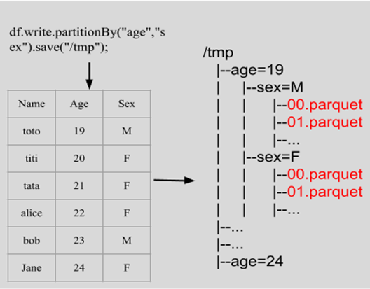{fig-align="center" width="1000"}

## Partitionnement {.smaller}

<br>

+----------------------------------------+-----------+-----------+-----------+
| Partitions                             | 2         | 5         | 1000      |
+========================================+===========+===========+===========+
| Colonne qui a servi au partitionnement | 74,50%    | 46,30%    | 16,66%    |
+----------------------------------------+-----------+-----------+-----------+
| Vers une autre colonne                 | 89,51%    | 191,01%   | 556,99%   |
+----------------------------------------+-----------+-----------+-----------+
| Select distinct(\*)                    | 136,79%   | 163,68%   | 1194,88%  |
+----------------------------------------+-----------+-----------+-----------+

<br>

```{r}
#| eval: false
#| echo: true

spark_write_parquet(ma_table, "hdfs:///resultats/ma_table.parquet", partition_by = c("age","sex"))

```

## Éviter le problème des exécuteurs inactifs {.smaller}

Supposons que le jeu de données ait 8 partitions, un exécuteur (avec seulement 1 core) ne peut exécuter qu'une tâche(task) à la fois, et une partition = une tâche.

Cas 1 : 6 exécuteurs, au dernier tour, il ne reste que 2 tâches, 4 exécuteurs seront inactifs. Cas 2 : 4 exécuteurs, 2\*4, aucun exécuteur inactif.

```{r}
#| eval: false
#| echo: true

# Get the number of partitions
num_partitions <- sdf_num_partitions(df)
print(num_partitions)

# Repartition the DataFrame to a specific number of partitions
df_repartitioned <- sdf_repartition(df, partitions = 10)
```

-   Le nombre de partitions doit être divisible par le nombre d'exécuteurs.
-   Le nombre de partitions doit être supérieur au nombre d'exécuteurs.

## Éviter trop de partitions {.smaller}

La création de tâches entraîne des surcharges, qui doivent toujours être inférieures à 50 % du temps total d'exécution de la tâche.

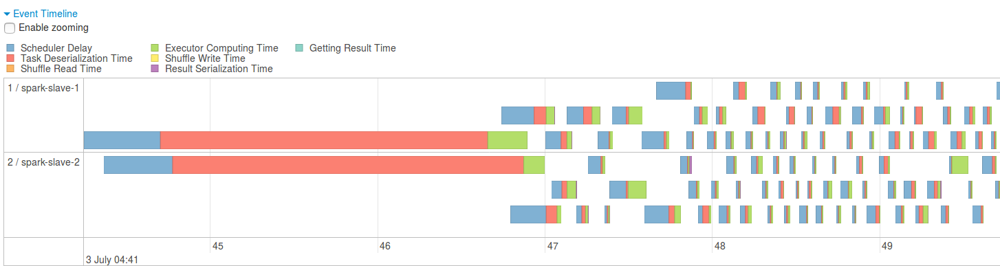

-   <div>

    ```{r}
    #| eval: false
    #| echo: true

    # Repartition the DataFrame to a specific number of partitions
    df_repartitioned <- sdf_repartition(df, partitions = 10)

    # Repartition the DataFrame by a specific column, e.g., "commune_code".
    # The partition number will be the distinct value number
    df_repartitioned <- sdf_repartition(df, partition_by = "commune_code")
    ```

    </div>

-   La répartition est une opération très coûteuse, utilisez-la judicieusement.

-   En général, la taille recommandée des partitions est d'environ 128 à 512 Mo.

## SparkUI {.smaller .scrollable}

Spark UI permet de consulter le plan logique et physique du traitement demandé. Trois outils permettent d'optimiser les traitements :

::: panel-tabset
## DAG


## GC

Vérifier que le `gc time` est inférieur à 10% du temps pour exécuter la tâche ✅


## Mémoire

Vérifier que la `storage memory` ne sature pas la mémoire ✅


:::

## Pyspark

<br>

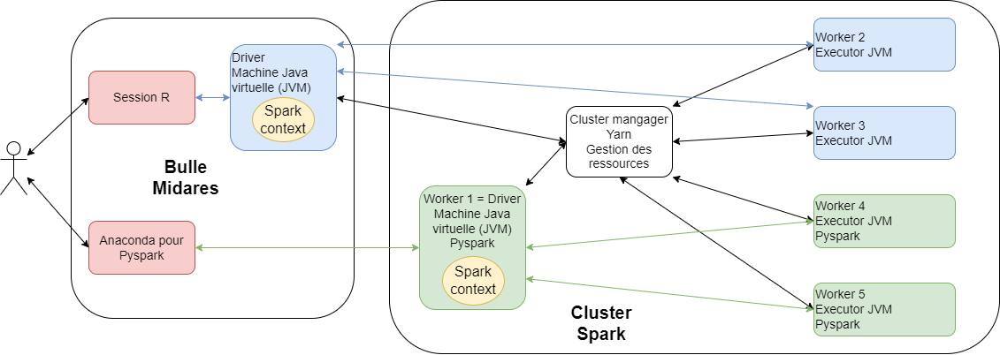{fig-align="center"}
